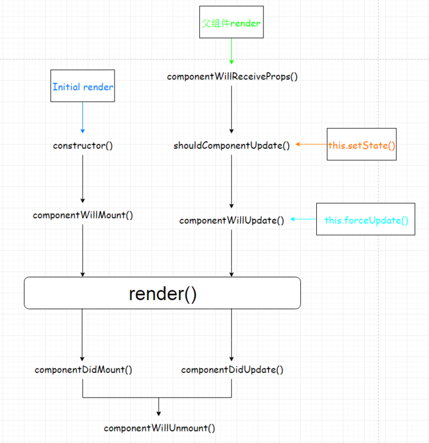
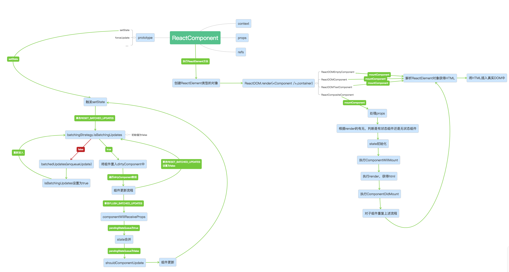
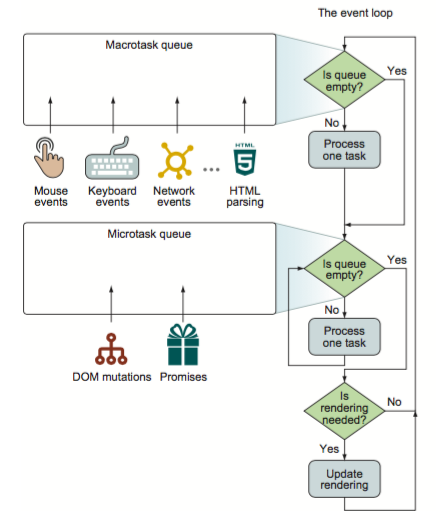

[TOC]

### JS
#### [ES6 的几个小技巧](https://juejin.im/post/5ab9a8196fb9a028b86e0615?utm_source=gold_browser_extension)

> 关于函数的强制参数，`Array.reduce`，对象解构，数组解构的相关技巧，挺有启发的


#### 获取dom的位置
下面是Jquery-3.3.1.js的实现，
通过`getBoundingClientRect`来获取dom相对于视窗的位置，再通过`defaultView`来获取视窗滚动的距离，相加获得dom的位置
```
function( options ) {

		// Preserve chaining for setter
		if ( arguments.length ) {
			return options === undefined ?
				this :
				this.each( function( i ) {
					jQuery.offset.setOffset( this, options, i );
				} );
		}

		var rect, win,
			elem = this[ 0 ];

		if ( !elem ) {
			return;
		}

		// Return zeros for disconnected and hidden (display: none) elements (gh-2310)
		// Support: IE <=11 only
		// Running getBoundingClientRect on a
		// disconnected node in IE throws an error
		if ( !elem.getClientRects().length ) {
			return { top: 0, left: 0 };
		}

		// Get document-relative position by adding viewport scroll to viewport-relative gBCR
		rect = elem.getBoundingClientRect();
		win = elem.ownerDocument.defaultView;
		return {
			top: rect.top + win.pageYOffset,
			left: rect.left + win.pageXOffset
		};
	}
```

#### 关于redux相关插件的选择
* Context
  * 我需要一个全局数据源且其他组件可以直接获取/改变全局数据源中的数据
* Redux
  * 我需要一个全局数据源且其他组件可以直接获取/改变全局数据源中的数据
  * 我需要全程跟踪/管理 action 的分发过程/顺序
* redux-thunk
  * 我需要一个全局数据源且其他组件可以直接获取/改变全局数据源中的数据
  * 我需要全程跟踪/管理 action 的分发过程/顺序
  * 我需要组件对同步或异步的 action 无感，调用异步 action 时不需要显式地传入 dispatch
* redux-saga
  * 我需要一个全局数据源且其他组件可以直接获取/改变全局数据源中的数据
  * 我需要全程跟踪/管理 action 的分发过程/顺序
  * 我需要组件对同步或异步的 action 无感，调用异步 action 时不需要显式地传入 dispatch
  * 我需要声明式地来表述复杂异步数据流（如长流程表单，请求失败后重试等），命令式的 thunk 对于复杂异步数据流的表现力有限

#### React的事件系统

[React源码分析6 — React合成事件系统](https://zhuanlan.zhihu.com/p/25883536)

> 文章中关于阻止时间冒泡的说法是有问题的，`e.stopPropagation`还是会阻止事件继续冒泡，只是这个`e`已经是Reacrt合成后的事件，`e.stopPropagation`也是封装过后的新的函数，处理了兼容性

流程大概是，在`Component`的创建（`mountComponent`）和更新（`updateComponent`）的时候，代码会遍历`jsx`，更新`dom`的`props`，其中就会获取到所有需要绑定的新事件。

然后一边将事件绑定到`document`上，同时将所有的事件存储在`listenerBank`对象中，结构类似为`listenerBank.onclick[nodeId] = callback`。

例如，触发点击事件的时候，通过原生的`event.target`，来获取到当前被触发的`dom`,然后遍历`dom`的父节点（这里所有的`dom`和结构，都是指`jsx`定义的`dom`结构，并不是真实的`dom`结构, 因为会出现`Portals`的情况），在获取到事件回调的时候不会立刻执行回调，直到获取到了所有的回调函数，然后遍历执行获取到的所有回调函数。
> 关于这里的解释是事件回调中可能会改变Virtual DOM结构,所以要先遍历好组件层级。

#### react life cycle





#### react forceUpdate

	流程和setState完全一致，只是在最后的`updateComponent`函数中，直接获取了当前`state`，作为需要更新的`state`，并且跳过了`shouldComponentUpdate`的判断，代码如下
	```
	updateComponent: function (transaction, prevParentElement, nextParentElement, prevUnmaskedContext, nextUnmaskedContext) {
	    console.log('updateComponent');
	    var inst = this._instance;
	    !(inst != null) ? process.env.NODE_ENV !== 'production' ? invariant(false, 'Attempted to update component `%s` that has already been unmounted (or failed to mount).', this.getName() || 'ReactCompositeComponent') : _prodInvariant('136', this.getName() || 'ReactCompositeComponent') : void 0;

	    var willReceive = false;
	    var nextContext;

	    // Determine if the context has changed or not
	    if (this._context === nextUnmaskedContext) {
	      nextContext = inst.context;
	    } else {
	      nextContext = this._processContext(nextUnmaskedContext);
	      willReceive = true;
	    }

	    var prevProps = prevParentElement.props;
	    var nextProps = nextParentElement.props;

	    // Not a simple state update but a props update
	    if (prevParentElement !== nextParentElement) {
	      willReceive = true;
	    }

	    // An update here will schedule an update but immediately set
	    // _pendingStateQueue which will ensure that any state updates gets
	    // immediately reconciled instead of waiting for the next batch.
	    if (willReceive && inst.componentWillReceiveProps) {
	      if (process.env.NODE_ENV !== 'production') {
	        measureLifeCyclePerf(function () {
	          return inst.componentWillReceiveProps(nextProps, nextContext);
	        }, this._debugID, 'componentWillReceiveProps');
	      } else {
	        inst.componentWillReceiveProps(nextProps, nextContext);
	      }
	    }

			// 在这里直接获取最终需要更新的state的时候，直接获取了当前的state
			// 如果是普通的setState则会获取到合并后需要更新的state
			// _processPendingState的代码在下面
	    var nextState = this._processPendingState(nextProps, nextContext);
	    console.log("nextState: ");
	    console.log(nextState);
	    var shouldUpdate = true;
	    console.log("inst.shouldComponentUpdate: " + inst.shouldComponentUpdate);
	    if (!this._pendingForceUpdate) {
	      if (inst.shouldComponentUpdate) {
	        if (process.env.NODE_ENV !== 'production') {
	          shouldUpdate = measureLifeCyclePerf(function () {
	            return inst.shouldComponentUpdate(nextProps, nextState, nextContext);
	          }, this._debugID, 'shouldComponentUpdate');
	        } else {
	          shouldUpdate = inst.shouldComponentUpdate(nextProps, nextState, nextContext);
	        }
	      } else {
	        if (this._compositeType === CompositeTypes.PureClass) {
	          shouldUpdate = !shallowEqual(prevProps, nextProps) || !shallowEqual(inst.state, nextState);
	        }
	      }
	    }

	    if (process.env.NODE_ENV !== 'production') {
	      process.env.NODE_ENV !== 'production' ? warning(shouldUpdate !== undefined, '%s.shouldComponentUpdate(): Returned undefined instead of a ' + 'boolean value. Make sure to return true or false.', this.getName() || 'ReactCompositeComponent') : void 0;
	    }

	    this._updateBatchNumber = null;
	    if (shouldUpdate) {
	      this._pendingForceUpdate = false;
	      // Will set `this.props`, `this.state` and `this.context`.
	      this._performComponentUpdate(nextParentElement, nextProps, nextState, nextContext, transaction, nextUnmaskedContext);
	    } else {
	      // If it's determined that a component should not update, we still want
	      // to set props and state but we shortcut the rest of the update.
	      this._currentElement = nextParentElement;
	      this._context = nextUnmaskedContext;
	      inst.props = nextProps;
	      inst.state = nextState;
	      inst.context = nextContext;
	    }
	    console.log('完成update');
	  }


		_processPendingState: function (props, context) {
	    var inst = this._instance;
	    var queue = this._pendingStateQueue;
	    var replace = this._pendingReplaceState;
	    this._pendingReplaceState = false;
	    this._pendingStateQueue = null;
			// 如果需要更新的state的队列是空的，则直接返回当前组件实例的state
	    if (!queue) {
	      return inst.state;
	    }

	    if (replace && queue.length === 1) {
	      return queue[0];
	    }

	    var nextState = _assign({}, replace ? queue[0] : inst.state);
	    for (var i = replace ? 1 : 0; i < queue.length; i++) {
	      var partial = queue[i];
	      _assign(nextState, typeof partial === 'function' ? partial.call(inst, nextState, props, context) : partial);
	    }

	    return nextState;
	  }
	```
#### curry and thunk
	curry是将多参数函数改为高阶单参数函数
	thunk是将多参数函数改为只有一个callback的函数
	是完全不一样的
	```
	var sum = function(a, b, c) {
		...
	}

	// curry
	var sumCurry = curry(sum);

	sumCurry(a)(b)(c);


	var readFileThunk = Thunk(fileName);
	readFileThunk(callback);

	// thunk
	var Thunk = function (fileName){
	  return function (callback){
	    return fs.readFile(fileName, callback);
	  };
	};
	```
#### 数组的几个重要方法

* `Array.prototype.slice`
* `Array.prototype.splice`
* `Array.prototype.reduce`
* `Array.prototype.sort`

### css

#### z-index
[深入理解CSS中的层叠上下文和层叠顺序](http://www.zhangxinxu.com/wordpress/2016/01/understand-css-stacking-context-order-z-index/)

#### 关于一些css的小问题
[CSS十问——好奇心+刨根问底=CSSer](http://www.cnblogs.com/dongtianee/p/4563084.html)

#### line-height 150% 与 1.5 的区别
当父元素的`line-height`为百分比时, 通过百分比计算出父元素本身的行高（使用px来表示），子元素默认继承父元素的行高

```
<div style="font-size: 16px; line-height: 150%;">
  父元素会行高为 16px * 150% = 24px
	<p style="font-size: 30px;">
	 子元素直接继承父元素的最终的行高 24px
	</p>
</div>
```

当父元素的`line-height`为数字时, 通过数字计算出父元素本身的行高（使用px来表示），子元素默认继承父元素的行高的计算方式

```
<div style="font-size: 16px; line-height: 1.5">
  父元素会行高为 16px * 1.5 = 24px
	<p style="font-size: 30px;">
	 子元素直接继承父元素行高的计算 30px * 1.5 = 45px
	</p>
</div>
```

相当于百分比时，子元素直接继承父元素的最终计算出来的行高，而为数字时，子元素继承的是父元素计算行高的方式（`line-height` * `font-size`）, 所以两种方式不影响自身，而是影响了子元素的行高的继承方式。

### 其他
#### https的握手过程
[SSL/TLS协议运行机制的概述](http://www.ruanyifeng.com/blog/2014/02/ssl_tls.html)


#### 怪异模式开启
判断当前模式
```
	 x-ua-compatible doctype Document Mode
	<meta http-equiv="X-UA-Compatible" content="IE=5" > // IE5 quirks 作死，千万别用
	<meta http-equiv="X-UA-Compatible" content="IE=7/8/9/10" > // IE7/8/9/10 Standards
	<meta http-equiv="X-UA-Compatible" content="IE=Edge" >  //  IE 最新版本的 Standards
	// c<!-- 据说下面两个 在 <!DOCTYPE html> 下面才起效 -->
	<meta http-equiv="X-UA-Compatible" content="IE=EmulateIE7/8/9" >// IE7/8/9 Standards
	<meta http-equiv="X-UA-Compatible" content="IE=EmulateIE10" > //IE10 Standards
```

```
document.compatMode // BackCompat：怪异模式；CSS1Compat：标准模式
```

[浏览器标准模式和怪异模式之间的区别是什么](https://zhidao.baidu.com/question/437436477445618004.html)


#### 缓存


#### no-cache 和 no-store的区别
基于《HTTP权威指南(中文版)》 191页的描述

首先`no-cache`在`Pragma`和`Cache-Control`都有，`no-store`则是`Cache-Control`的属性。
```
Pragma: no-cache
Cache-Control: no-store
Cache-Control: no-cache
```

`Cache-Control: no-store`是不会存储在本地的缓存区中。每次都是请求获取最新的数据。
`Cache-Control: no-cache`是可以存储在本地缓存区中。只是在与原始服务器进行比较以后，才可以提供给客户端使用。准确的来说`no-cache`表示为`do-not-serve-from-cache-without-revalidation`;

#### GET与POST的区别
[99%的人都理解错了HTTP中GET与POST的区别](https://zhuanlan.zhihu.com/p/22536382)

* GET在浏览器回退时是无害的，而POST会再次提交请求。
* GET产生的URL地址可以被Bookmark，而POST不可以。
* GET请求会被浏览器主动cache，而POST不会，除非手动设置。
* GET请求只能进行url编码，而POST支持多种编码方式。
* GET请求参数会被完整保留在浏览器历史记录里，而POST中的参数不会被保留。
* GET请求在URL中传送的参数是有长度限制的，而POST么有。
* 对参数的数据类型，GET只接受ASCII字符，而POST没有限制。
* GET比POST更不安全，因为参数直接暴露在URL上，所以不能用来传递敏感信息。
* GET参数通过URL传递，POST放在Request body中。


* GET产生一个TCP数据包；POST产生两个TCP数据包。

> 对于GET方式的请求，浏览器会把http header和data一并发送出去，服务器响应200（返回数据）；
> 而对于POST，浏览器先发送header，服务器响应100 continue，浏览器再发送data，服务器响应200 ok（返回数据）。


#### 引起reflow的一些情况

[What forces layout / reflow
](https://gist.github.com/paulirish/5d52fb081b3570c81e3a)


#### event-loop


#### 跨域的几种解决 式
* src
	* JSONP
	* iframe (需要处理iframe之间或者父子页之间的通信)
		* window.name
		* document.domain
		* location.hash
		* postMessage
* server
	 * CORS
	 * server proxy
	 	* node
		* nginx
* other
	* websokcet(本身支持跨域)
	* SSE(基于CORS)

[那些年前端跨过的域](https://juejin.im/post/5ae16f26f265da0ba60f7f9a#heading-16)
